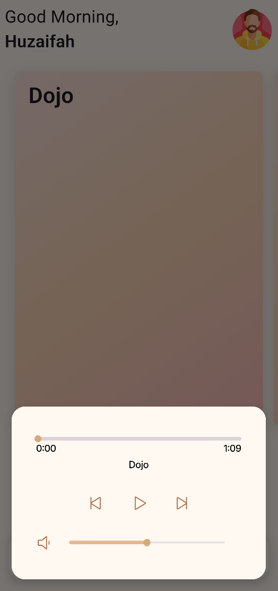

# DOJO Flutter App

A Flutter application that features audio recording, playback, and a custom navigation system. The app provides a seamless user experience with a dynamic home page, a search feature, and custom audio player functionalities.

## Features

- **Home Page**: Displays a list of audio recordings with options to play and interact.
- **Search Functionality**: Search through recordings with a dedicated search page.
- **Audio Player**: A custom audio player with controls for play, pause, and seek functionalities.
- **Recording**: Record audio with an easy-to-use interface and manage recordings.

## Screenshots





## Getting Started

### Prerequisites

- Flutter SDK: [Flutter installation guide](https://flutter.dev/docs/get-started/install)
- Dart SDK (comes with Flutter)

### Installation

1. **Clone the repository**
    ```bash
    git clone https://github.com/your-username/dojo-flutter-app.git
    ```
2. **Navigate to the project directory**
    ```bash
    cd dojo-flutter-app
    ```
3. **Install dependencies**
    ```bash
    flutter pub get
    ```
4. **Run the app**
    ```bash
    flutter run
    ```

## Project Structure

- `lib/`
  - `Screens/`
    - `Home Page/`
      - `home_page.dart`: The main page displaying recordings.
      - `custom_navigation_bar.dart`: Custom bottom navigation bar.
    - `Search/`
      - `search_page.dart`: Search functionality for recordings.
    - `Audio Player/`
      - `audio_player.dart`: Custom audio player with controls.
    - `New Recording/`
      - `new_recording.dart`: Page for recording new audio.

## Usage

### Home Page

- The main screen displaying a list of audio recordings.
- Tap on a recording to open the audio player.
- Use the bottom navigation bar to navigate to different pages.

### Audio Player

- Controls to play, pause, and seek through audio.
- Volume control and progress tracking.

### Recording

- Start and stop audio recording.
- Save and manage recorded audio files.

### Navigation

- Custom navigation bar with options to navigate to the home page, search page, and recording page.

## Dependencies

- `flutter_hooks`: For managing widget lifecycle events.
- `hooks_riverpod`: For state management.
- `phosphor_flutter`: Icon package for using Phosphor icons.
- `audio_video_progress_bar`: For displaying and interacting with audio progress.

